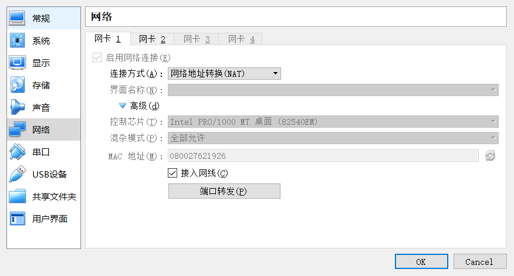

[TOC]

# connect-the-dots
目标：/home/user.txt and /root/root.txt

## 环境准备

由于VMware会出现种种问题，于是改成了Virtual Box,而且Vulhub上的大部分靶机都是使用Virtual Box制作的


附上一些相关的配置截图：

kali 2019.04 
第一块网卡没做修改


添加了第二块网卡


Connect-the-dots作为靶机，同样添加了第二块网卡

## 信息收集
kali IP ： 192.168.99.101


通过nmap发现另一台主机(注意netdiscover和arp-scan都无法使用了)


主机开放的所有服务：


一个个来看

## 21端口

vsftp 服务， metasploit搜索payload

返回的信息：

```
msf5 exploit(unix/ftp/vsftpd_234_backdoor) > exploit 

[*] 192.168.99.104:21 - Banner: 220 Welcome to Heaven!
[*] 192.168.99.104:21 - USER: 530 Permission denied.
[-] 192.168.99.104:21 - This server is configured for anonymous only and the backdoor code cannot be reached
[*] Exploit completed, but no session was created.
```

尝试匿名登陆没有成功


## 80端口

目录遍历：


扫描结果有两个index页面，查看其中一个发现：

发现了注释


访问发现是一个登陆页面，发现这个登陆页面并不会有数据包，是个静态页面


然后访问 `/mysite`


查看文件后发现


是jsfuck编码

jsfuck解码网站 http://www.jsfuck.com/#

也可以直接用浏览器的控制台解码

可以将其复制到浏览器的控制台：
然后输入：


这样可以免去手动复制粘贴的麻烦


得到结果：


```
You're smart enough to understand me. Here's your secret, TryToGuessThisNorris@2k19
```

得到了secret，猜测是ssh登陆的口令


## 2049端口

开放了NFS服务

使用nmap或者metasploit探测可以挂载的目录，
```
msf5 auxiliary(scanner/nfs/nfsmount) > exploit 

[+] 192.168.99.104:111    - 192.168.99.104 NFS Export: /home/morris [*]
[*] 192.168.99.104:111    - Scanned 1 of 1 hosts (100% complete)
[*] Auxiliary module execution completed
```

获得挂载目录 `/home/morris`

安装nfspysh:

`git clone https://github.com/bonsaiviking/NfSpy.git`


## ssh服务

nmap没有扫除ssh开放的端口，因为这台靶机的ssh并不是开放在通常的22号端口上

通过扫描确认：


ssh开放的端口是7822

尝试用之前得到的口令去登陆，用户名是`morris`
登陆失败

从80端口的`index.html`知道，M和N的命名规则，尝试修改用户名为`norris`


登陆成功！
得到`user.txt`的内容


之后去`/var/www/html`目录下查看文件

发现了`.secretfile.swp`文件
直接查看提示权限不够，于是想到从网页下载

可以看到`.secretfile.swp`文件的权限被设置为只有`www-data`用户才能读写


通过`vim -r secretfile.swp`得到源文件内容

```
I see you're here for the password. Holy Moly! Battery is dying !! Mentioning below for reference..

blehguessme090
```

于是成功登陆morris用户


## 最后的“提权”

登陆了morris用户之后，还是无法进入到root的目录下查看文件

先上一个`LinEnum.sh`提权辅助脚本，但是并未发现有意思的东西

又去找到了另外一个脚本 https://github.com/carlospolop/privilege-escalation-awesome-scripts-suite/blob/master/linPEAS/linpeas.sh

功能比较全面，并且发现了这个：

查阅文档发现了这个，类似SUID


那么尝试用tar去打包root目录下的文件

打包失败，原来这个命令应该在`norris`用户下执行


于是将root目录下的文件打包


解压之后得到flag


## 参考
https://medium.com/@barrymalone/vulnhub-connect-the-dots-walkthrough-ba4566674ba
https://medium.com/@alshawwa/connect-the-dots-vulnhub-61787608dc6c